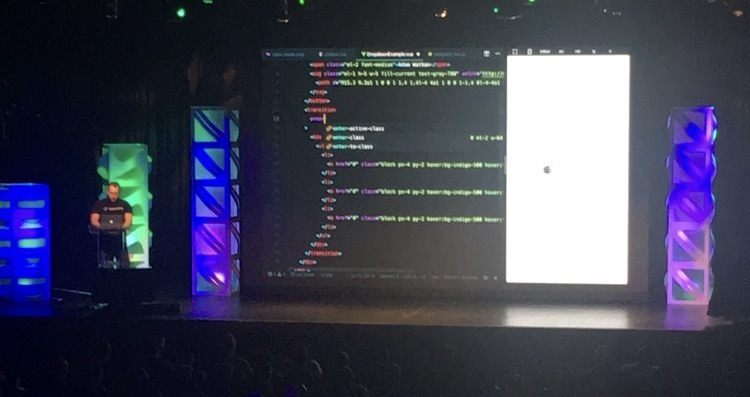

# Laravel Examples:


```

A Real coding assesment that shows what I can produce in 1 hour and 12 minuets. 

```
> [See Code](https://github.com/mokeseven7/laravel-power-hour)

 
```

Another coding assesment, but one with enough time code a little more elegantly. Examples include single line controllers, and a multi tenant isolation strategy without using query scopes. 
```

> [See Code](https://github.com/mokeseven7/deedee/blob/main/app/Http/Controllers/DeeDeeController.php#L14) | [See Code](https://github.com/mokeseven7/deedee/commit/7920e2b74ba6219288ecc2e944456fc6f2876b6e)


   
```
Rewriting as much of a companies REST API as a GraqhQL API in an hour,  with no other direction then a Swaggerfile.

```
> [See Code](https://github.com/mokeseven7/huntress)

``` 

A bonus implementation of multi tenant 
context switching without using query scopes:

```
>[See Code](https://github.com/mokeseven7/deedee/commit/7920e2b74ba6219288ecc2e944456fc6f2876b6e)


```

That time a company asked me to make an entire Subscribtion service as the coding assesment. The code itself is not code im proud of, but the fact I actually managed to pull this off kind of amazes me. 

*With bonus video of me awkwardly making my Youtube debut per thier request.

```
>[See Code](https://github.com/mokeseven7/streamlabs) | [See Awkward](https://youtu.be/cIAeLCngx3g)


 

# Bonus:
Adam Waltham Trying To Convince a *mostly* unimpressed audiance that tailwind was actually worth learning.   
You were right buddy.   
Laracon NYC, 2019

